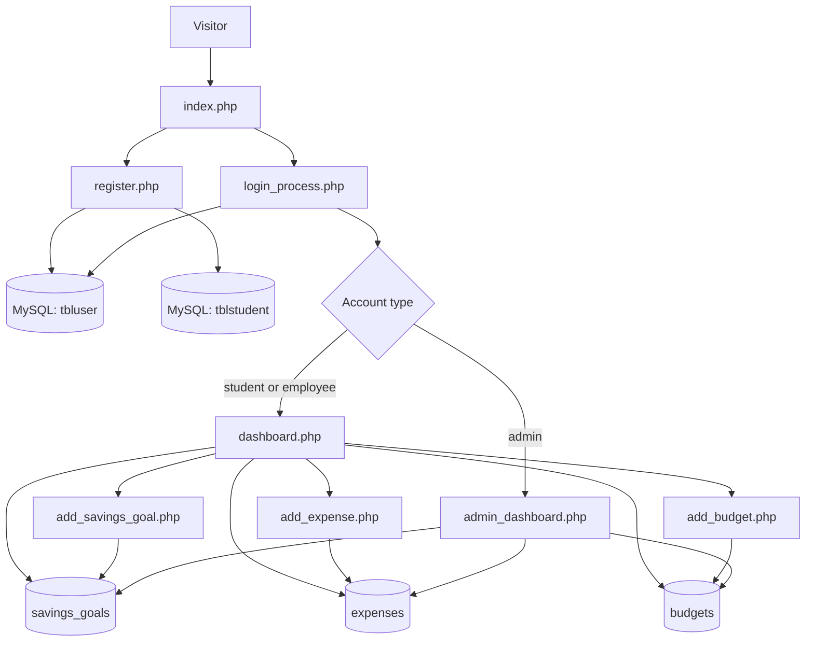

# CashGuard

  

CashGuard is a PHP and MySQL personal finance tracking project. It provides account registration and login, a personal dashboard for budgets, expenses, and savings goals, and an administrator dashboard with user and spending summaries.

  

> **Project status:** This repository contains a lightweight PHP application without a framework or dependency manager. Some features described on the landing page are currently promotional copy and are not implemented in the backend; see [Current scope and limitations](#current-scope-and-limitations).

  

## Contents

  

-  [Features](#features)

-  [How the application fits together](#how-the-application-fits-together)

-  [Requirements](#requirements)

-  [Installation](#installation)

-  [Database schema](#database-schema)

-  [Run locally](#run-locally)

-  [User guide](#user-guide)

-  [Administration](#administration)

-  [Project layout](#project-layout)

-  [Data model](#data-model)

-  [Security notes](#security-notes)

-  [Current scope and limitations](#current-scope-and-limitations)

-  [Troubleshooting](#troubleshooting)

  

## Features

  

### Account and session flows

  

- Register an account with a first name, last name, gender, username, password, and account type (`student` or `employee`). Student registration also asks for a program and year level.

- Passwords are stored using PHP's `password_hash()` and checked with `password_verify()`.

- Log in with a username and password. Admin accounts are routed to the admin dashboard; student and employee accounts are routed to the personal dashboard.

- Change a password after confirming the current password, and log out to clear the session.

  

### Personal finance dashboard

  

- Create savings goals with a name, target amount, and target date.

- Record expenses with a description, category, amount, and date.

- Set a budget for a month and year.

- View saved goals, recorded expenses, budgets, total saved, total expenses, the latest budget, and a remaining-budget figure.

  

### Administrator dashboard

  

- View total registered users, student and employee counts, and average budget amount.

- Review saved goals and expenses across users.

- View charts for spending grouped by calendar month and user counts grouped by gender. Charts use Chart.js from a CDN.

  

## How the application fits together

  



  

The PHP pages use `connect.php` for the shared MySQL connection. Login state and identity are stored in PHP sessions. The application uses prepared statements for most user-specific reads and writes.

  

## Requirements

  

- PHP 7.4 or newer with the `mysqli` extension. PHP 8.x is recommended.

- MySQL 5.7+ or MariaDB with support for InnoDB and foreign keys.

- A local PHP/MySQL environment such as XAMPP, WAMP, MAMP, or separately installed PHP and MySQL.

- A web browser. The admin charts load Chart.js from jsDelivr, and some pages load fonts/icons from external CDNs.

  

No Composer packages, npm packages, build step, or frontend framework are included in this repository.

  

## Installation

  

1. Clone or download this repository into your PHP server's document root. For XAMPP on Windows, that is commonly `C:\\xampp\\htdocs\\cashguard`.

  

```bash

git clone <repository-url> cashguard

```

  

2. Start the MySQL service and create the application database:

  

```sql

CREATE  DATABASE dbg8java

CHARACTER  SET utf8mb4

COLLATE utf8mb4_unicode_ci;

```

  

3. Create the tables using the SQL in [Database schema](#database-schema). The repository's `SQL-to-implement.txt` contains schema drafts and notes; it also contains duplicate table definitions and an `ALTER TABLE` statement that assumes a particular existing constraint, so use the consolidated schema below for a fresh installation.

  

4. Check `connect.php`. The current connection expects MySQL at `localhost`, username `root`, an empty password, and database `dbg8java`. Update these values to match your local MySQL setup.

  

5. Open the project through the PHP web server, for example `http://localhost/cashguard/`. Do not open the PHP files directly from the filesystem.

  

6. Register a student or employee account, then log in. To enable the admin dashboard, promote an account as described in [Administration](#administration).

  

## Database schema

  

Run this once in the `dbg8java` database for a fresh install:

  

```sql
CREATE  TABLE  IF  NOT  EXISTS tbluser (

uid  INT AUTO_INCREMENT PRIMARY KEY,

firstname VARCHAR(50) NOT NULL,

lastname VARCHAR(50) NOT NULL,

gender VARCHAR(10),

usertype VARCHAR(20),

username VARCHAR(50) NOT NULL  UNIQUE,

password  VARCHAR(255) NOT NULL,

created_at TIMESTAMP  DEFAULT CURRENT_TIMESTAMP

) ENGINE=InnoDB DEFAULT CHARSET=utf8mb4;
```
```sql
CREATE  TABLE  IF  NOT  EXISTS tblstudent (

sid  INT AUTO_INCREMENT PRIMARY KEY,

program VARCHAR(20),

yearlevel INT,

uid  INT,

CONSTRAINT fk_tblstudent_user

FOREIGN KEY (uid) REFERENCES tbluser(uid) ON DELETE CASCADE

) ENGINE=InnoDB DEFAULT CHARSET=utf8mb4;
```
```sql
CREATE  TABLE  IF  NOT  EXISTS savings_goals (

goal_id INT AUTO_INCREMENT PRIMARY KEY,

uid  INT,

goal_name VARCHAR(255),

target_amount DECIMAL(10, 2),

amount_saved DECIMAL(10, 2) DEFAULT  0,

target_date DATE,

CONSTRAINT fk_savings_goals_user

FOREIGN KEY (uid) REFERENCES tbluser(uid) ON DELETE CASCADE

) ENGINE=InnoDB DEFAULT CHARSET=utf8mb4;
```
```sql
CREATE  TABLE  IF  NOT  EXISTS expenses (

expense_id INT AUTO_INCREMENT PRIMARY KEY,

sid  INT,

expense_name VARCHAR(255),

category VARCHAR(100),

amount DECIMAL(10, 2),

expense_date DATE,

CONSTRAINT fk_expenses_student

FOREIGN KEY (sid) REFERENCES tblstudent(sid) ON DELETE CASCADE

) ENGINE=InnoDB DEFAULT CHARSET=utf8mb4;
```
```sql
CREATE  TABLE  IF  NOT  EXISTS budgets (

budget_id INT AUTO_INCREMENT PRIMARY KEY,

uid  INT,

month  INT,

year  INT,

total_budget DECIMAL(10, 2),

amount_spent DECIMAL(10, 2) DEFAULT  0,

CONSTRAINT fk_budgets_user

FOREIGN KEY (uid) REFERENCES tbluser(uid) ON DELETE CASCADE

) ENGINE=InnoDB DEFAULT CHARSET=utf8mb4;
```

  

The application expects all five tables and these column names. Registration creates a `tblstudent` row for every account, including employees, because expense records refer to a student row (`sid`). Savings goals and budgets are linked directly to the user (`uid`).

  

## Run locally

  

### PHP's built-in development server

  

From the repository root, run:

  

```bash

php  -S  localhost:8000

```

  

Then visit [http://localhost:8000](http://localhost:8000). MySQL must already be running and configured in `connect.php`. PHP's built-in server is for local development, not production hosting.

  

### XAMPP/WAMP/MAMP

  

Place the repository under the environment's web root, start Apache and MySQL, and browse to the corresponding local project URL (for example, `http://localhost/cashguard/`). Import the database schema before opening the site.

  

## User guide

  

### Create an account

  

1. Open the landing page and choose **SignUp**.

2. Complete the required fields. Usernames must be unique; passwords must be at least six characters and match the confirmation field.

3. For a student account, enter a program and year level.

4. After successful registration, return to the login form and sign in.

  

The registration handler inserts the account and its `tblstudent` record in one database transaction. The public registration form offers student and employee types; admin access is assigned separately in the database.

  

### Use the personal dashboard

  

After login, `dashboard.php` displays the account's savings goals, expenses, and budgets. Use the forms on the page to add records:

  

| Record | Required fields | Stored in |
|  ---  |  ---  |  ---  |
| Savings goal | Goal name, target amount, target date |  `savings_goals`  |
| Expense | Name, category, amount, expense date |  `expenses`  |
| Budget | Month (1–12), year, total budget |  `budgets`  |

  

The displayed remaining amount is calculated as the latest budget's `total_budget` minus the sum of the user's recorded expenses. The current implementation does not scope that expense sum to the budget month and year. The `amount_spent` budget column is initialized to zero when a budget is created and is not updated by expense entry.

  

### Change password and log out

  

Use **Change Password** to provide the current password and matching new password values. Choose **Logout** to destroy the current session and return to the landing page.

  

## Administration

  

The login handler sends accounts whose `usertype` is exactly `admin` to `admin_dashboard.php`. Registration does not create admin accounts, so promote a trusted account manually after registering it:

  

```sql
UPDATE tbluser

SET usertype =  'admin'

WHERE username =  'your_username';
```

  

Replace `your_username` with the registered username. The admin page is guarded by a session check and an `admin` role check. Its tables and charts report aggregate or cross-user finance data; grant admin status only to accounts that should be allowed to see it.

  

## Project layout

  

| File or folder | Purpose |
|  ---  |  ---  |
|  `index.php`  | Landing page, login form, feature/about/contact sections, and login error display. |
|  `register.php`  | Registration form and account/student record creation. |
|  `login_process.php`  | Validates credentials, creates the login session, and routes by account type. |
|  `dashboard.php`  | Personal dashboard and finance summaries. |
|  `add_savings_goal.php`  | Saves a goal submitted from the user dashboard. |
|  `add_expense.php`  | Saves an expense submitted from the user dashboard. |
|  `add_budget.php`  | Saves a budget submitted from the user dashboard. |
|  `admin_dashboard.php`  | Admin-only summary tables and Chart.js reports. |
|  `change_password.php`  | Password change form and update handler. |
|  `process_change_password.php`  | Alternate password update endpoint; the current form in `change_password.php` handles its own POST instead. |
|  `logout.php`  | Clears and destroys the PHP session. |
|  `connect.php`  | MySQL connection configuration. |
|  `SQL-to-implement.txt`  | Historical schema drafts and database notes. |
|  `image/`  | Logos, feature artwork, and other landing-page images. |

  

## Data model
```mermaid
erDiagram
    TBLUSER ||--o| TBLSTUDENT : has
    TBLUSER ||--o{ SAVINGS_GOALS : sets
    TBLUSER ||--o{ BUDGETS : creates
    TBLSTUDENT ||--o{ EXPENSES : records

    TBLUSER {
        int uid PK
        string firstname
        string lastname
        string gender
        string usertype
        string username UK
        string password
        timestamp created_at
    }

    TBLSTUDENT {
        int sid PK
        string program
        int yearlevel
        int uid FK
    }

    SAVINGS_GOALS {
        int goal_id PK
        int uid FK
        string goal_name
        decimal target_amount
        decimal amount_saved
        date target_date
    }

    EXPENSES {
        int expense_id PK
        int sid FK
        string expense_name
        string category
        decimal amount
        date expense_date
    }

    BUDGETS {
        int budget_id PK
        int uid FK
        int month
        int year
        decimal total_budget
        decimal amount_spent
    }

  ```

Foreign keys cascade deletes from users to their student rows, goals, and budgets, and from student rows to expenses. In normal registration, each user receives one student row, though the schema does not enforce one row per user with a unique constraint.

  

## Security notes

  

- Database access in `connect.php` currently uses the local development credentials `root` with a blank password. Configure a dedicated database user with only the privileges the application needs before deploying anywhere shared.

- Passwords are hashed with PHP's password API, and login uses prepared statements.

- The login handler applies a temporary lockout after repeated failed attempts, tracked in the PHP session. This is a per-session control rather than an account-wide or IP-wide rate limit.

- Use HTTPS and production-grade PHP/MySQL configuration for any deployment beyond local development.

- Review output escaping, input validation, authorization checks, and CSRF protection before exposing the application publicly. The current pages do not implement CSRF tokens, and several displayed database values are emitted without consistent HTML escaping.

- Admin reports expose cross-user finance data to admin accounts.

  

## Current scope and limitations

  

The repository implements manual record entry and basic summaries. The landing page also describes offline access, automatic transaction tracking, personalized financial tips, notifications, and contact form submission; no corresponding offline storage/synchronization, financial advice engine, alert system, or working contact backend is present in the PHP files.

  

Other implementation details to be aware of:

  

- Savings goals can be created and displayed, but there is no form or endpoint for adding to `amount_saved` or editing/deleting a goal.

- Expenses can be created and displayed, but there is no edit/delete flow.

- Budgets can be created and displayed, but they are not unique by user/month/year and expense entry does not update `amount_spent`.

- Expense records belong to `tblstudent.sid`; registration currently creates this row for employees as well, allowing the same expense flow for both account types.

- Admin monthly charts group by month number without separating years, so values from the same month in different years are combined.

-  `process_change_password.php` exists as an alternate handler but the visible form posts back to `change_password.php`.

- The login form includes a “Forgot Password?” label, but no reset flow is implemented.

  

## Troubleshooting

  

| Symptom | Things to check |
|  ---  |  ---  |
|  `Connection failed` or blank/error page on startup | Confirm MySQL is running, the `dbg8java` database exists, and the credentials in `connect.php` are correct. |
|  `Table ... doesn't exist`  | Import all five tables from [Database schema](#database-schema) into the same database configured in `connect.php`. |
| Registration fails while inserting a student row | Confirm `tblstudent` exists and its `uid` foreign key references `tbluser(uid)`; inspect the PHP/MySQL error log for the underlying constraint or data error. |
| Admin page redirects to the landing page | Sign in as an account whose `tbluser.usertype` value is exactly `admin`. |
| Chart area is empty | Check that the page can load Chart.js from jsDelivr and that the database has data for the chart queries. |
| Images do not appear | Serve the app from its web root and keep the `image/` directory alongside the PHP files, preserving the filename capitalization. |

  

---

  

CashGuard is an educational project. Financial records entered into a local installation are stored in its configured MySQL database.